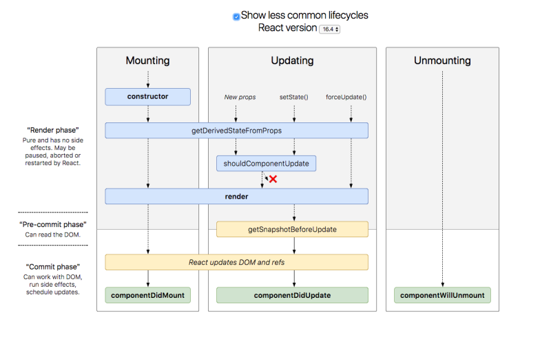

# Tips

整理一些文章與小知識，以供複習或尋找solution


## React Component
1. 程式碼 .bind(this)優化，使用arrow function 取代 -- [1](https://segmentfault.com/q/1010000017412221) , [2](https://carsonwah.github.io/react-native-arrow-function-and-this.html) 

> ant design 的範例都是使用這種寫法

2. PureComponent 謹慎使用，讓性能優化

> 比對前後props、state是否有改變，沒有改變shouldComponentUpdate會return false，則物件不會再次執行render()

3. 由於Immutable data structures的關係，使用PureComponent的shallowEqual可能會出錯(不如預期)，所以在setState之前，不能直接引用props或state，必須創建一個新的物件 -- [1](https://blog.techbridge.cc/2018/01/05/react-render-optimization/)

> 習慣必須養成不要直接調用props、state，需另創一個物件，如:const arr = [...this.state.array]

4. 在react中如果function想要傳遞參數，有兩種方法 [1]onClick={()=>this.myFunction(params)}, [2]onClick={this.myFunction.bind(this,params)} --[詳解arrow function in react](https://frontarm.com/james-k-nelson/when-to-use-arrow-functions/)

> 由於兩種方法都會創造新的函數，如果在render()中使用，每次重新render都會重新創造函數，會造成些許的效能問題

> 如果是用這兩種方法傳遞給child component 或 purecomponent，由於每次都創造新的函數，會使得purecomponent失效，解法如下-[1](https://stackoverflow.com/questions/39226757/react-passing-parameter-with-arrow-function-in-child-component)

> 不需要排斥使用這樣的寫法，但在撰寫程式時可以盡量縮減，當網頁有效能問題時，可以再回來構思如何修改。

5. 卸除component時(componentWillUnmount階段)，不要有setState()的執行

> 雖然有此情況不會造成程式崩壞，但會有warning，本次經驗是在使用者請求資料後，突然放棄等候而跳頁產生。

6. 承5，必須在componentWillUnmount階段剔除listener或者setInerval等等--[1](https://www.robinwieruch.de/react-warning-cant-call-setstate-on-an-unmounted-component/)

7. 組件的復用--[1](https://segmentfault.com/a/1190000015007317) --[2](https://juejin.im/post/5c7244b66fb9a049e93d5c16#comment)

> 需要才加載--[3](https://juejin.im/post/5ad5bc306fb9a028b92da563)

8. controlled component & uncontrolled component 的使用情境--[1](https://goshakkk.name/controlled-vs-uncontrolled-inputs-react/)

> 受控組件即是指使用setState去監控擁有輸出輸入功能的element，如:select, textarea, input等等，功能較為強大，能夠做到即時驗證、強迫改變資料輸入型態、autocomplete等等，
非受控組件與傳統的HTML element有些相像，相對受控組件而言，程式碼實現較為精簡，但能延伸出來的變化也較少。--[1](https://react.docschina.org/docs/forms.html) --[2](https://react.docschina.org/docs/uncontrolled-components.html)

9. React Lifecycle -- [1](https://iandays.com/2018/07/27/reactlife/index.html)



## React Router
1. 頁面傳值有三個方法： 1. props.params, 2. query, 3. state --[1](https://blog.csdn.net/qq_23158083/article/details/68488831)

> 文章說明query方法類似get，會併接url，而state類似post，不會以明文傳遞，但不知原因為何，實際使用兩者的url都沒有顯示，還是推薦使用state。

## Axios
1. 在IE中使用axios，安裝babel-polyfill，在import時必須擺在第一個。

> 由於IE沒支援promise語法，需要使用額外套件編譯。

2. 在cancel request的時候，使用 cancelToken: new CancelToken(function(cancel){})，必須注意post的cancel必須寫在config中。 --[1](https://stackoverflow.com/questions/44852054/cant-cancel-axios-post-request-via-canceltoken)

> axios 文檔中寫道: axios.get(url[, config]) , axios.post(url[, data[, config]])，在post的config須注意是第二個參數。

## javascript

1. 提升(Hoisting)，若是某行程式碼需要取得的變數宣告在其後執行，編譯器會自動幫程式碼在最上頭加上var x，此時值為undefined，直到程式執行給值那行--[1](https://ithelp.ithome.com.tw/articles/10191549)

> 函數物件同樣會被hoisting, 如: var x = function(){...}, 單純函數不會。

2. callback function 與 IIEF --[1](https://ithelp.ithome.com.tw/articles/10192739)

> 把函數當成另一個函數的參數，主要作用在制定函數執行順序，徹底理解文章中舉的例子。

> 有趣的題目變化--[1](https://github.com/Advanced-Frontend/Daily-Interview-Question/issues/43)

3. 同步(Synchronous) 與 非同步(Asynchronous)--[1](https://ithelp.ithome.com.tw/articles/10194569)

> Callback Hell : 大量使用非同步且又想要依照固定的順序來執行時， 就可能會出現

> 使用promise語法來避免callback hell --[1 promise語法使用概念](https://codertw.com/%E7%A8%8B%E5%BC%8F%E8%AA%9E%E8%A8%80/148940/)

4. 非侵入式javascript --[1](https://segmentfault.com/a/1190000008820759)

> 這樣的寫法可以分離HTML與javascript，達成視圖與邏輯分離的架構，程式碼便不會全部混雜在一起。但如此一來，單看HTML的element無法知道他被綁定了甚麼事件，必須要去查詢js document中的所有監聽事件。

> React 中的 JSX寫法反其道而行，兩者互相結合，將component合適的切割分層，程式碼便不會看起來混亂。

5. Pass by value、 Pass by reference 、Pass by sharing(scope的關係) --[1](https://ithelp.ithome.com.tw/articles/10191057)

> 物件、陣列可變，基本型不可變

6. 事件的註冊綁定-[1] on-event(HTML屬性), [2] on-event (非HTML屬性), [3] EventTarget.addEventListener()

7. event capturing & event bubbling (event flow)--[1](https://ithelp.ithome.com.tw/articles/10191970) [2 huli's](https://github.com/aszx87410/blog/issues/21)

> 必須深刻了解其傳遞方式

8. 阻擋事件冒泡 e.stopPropagation() --[1](https://ithelp.ithome.com.tw/articles/10192015)

> e.stopPropagation()、this的導向、event.currentTarget、Event Delegation

> 文章中所提到的重點：e.target 其實是「觸發事件的元素」，而 this 指的是「觸發事件的目標」元素，也就是 event.currentTarget

9. event.preventDefault() 可在addEventListener使用，讓element的原始動作失效。

> return false也能有同樣效果

10. rest operate &　spread orperate --[1](https://pjchender.blogspot.com/2017/01/es6-spread-operatorrest-operator.html)

11. lodash & lazy 提升js程式碼可維護性、效能。

> 注意不要過早優化程式效能，初期開發階段，可維護性、可讀性、可測試性更為重要。

12. clean code for js --[1](https://github.com/ryanmcdermott/clean-code-javascript#use-promises-not-callbacks)

13. map & reduce --[1](http://fred-zone.blogspot.com/2017/01/javascript-mapreduce.html)

> 利用 .reduce() 進行陣列扁平化

14. Property descriptor --[1](https://ithelp.ithome.com.tw/articles/10193747)

> 屬性描述器:value, writable, enumerable, configurable, get, set。

> Object.defineProperty(obj, prop, descriptor), Object.getOwnPropertyDescriptor()

15. Prototype --[iT邦幫忙1](https://ithelp.ithome.com.tw/articles/10194154) [iT邦幫忙2](https://ithelp.ithome.com.tw/articles/10194356)

> A instanceof B , 'xxx' in A -- 透過「原型鏈」檢查屬性, A.hasOwnProperty('xxx') -- 檢查的屬性，是否為「物件本身」所有; 

> Object.prototype.hasOwnProperty(), Object.prototype.toString(), Object.prototype.valueOf()

> Object.setPrototypeOf(A, B), 被當作原型的物件只能唯一(__proto__)。

> 當物件實體與它的原型同時擁有同樣的屬性或方法時，會優先存取自己的屬性或方法，如果沒有才會再順著原型鏈向上尋找。

16. javascript是靜態作用域 --[1](https://github.com/aszx87410/blog/issues/35)

```javascript
var a = 100
function echo() {
  console.log(a) // 100 or 200?
}
  
function test() {
  var a = 200
  echo()
}
  
test() //100
```

> but... [2](https://kuro.tw/posts/2017/10/12/What-is-THIS-in-JavaScript-%E4%B8%8A/)

```javascript
var foo = 'foo';
var obj = {
  foo: 'foo in Object'
};

var sayFoo = function() {
  console.log( this.foo );
};

obj.sayFoo = sayFoo;

obj.sayFoo();   // 'foo in Object'
sayFoo();       // 'foo'
```
> 在物件中的this會改變指向方向。

17. this的scope

> JavaScript 中，用來切分變數的最小作用範圍 (scope)，也就是我們說的有效範圍的單位，就是 function。

> 當沒有特定指明 this 的情況下，預設綁定 (Default Binding) this 為 「全域物件」，也就是 window。 (但是嚴格模式底下，會禁止this自動成為全域物件)

18. class & function [1](https://overreacted.io/zh-hant/how-does-react-tell-a-class-from-a-function/)

```javascript
// 只是個函式
function Person(name) {
  this.name = name;
}

var fred = new Person('Fred'); // ✅ Person {name: 'Fred'}
var george = Person('George'); // 🔴 不行
```

> 藉由在呼叫前增加 new，我們告訴 JavaScript 說：「嘿 JavaScript，我知道 Person 只是一個函式，但讓我們假裝它就像一個類別的建構子，創建一個 {} 物件並且將 Person 函式內部的 this 指向這個物件，這樣我就能設置 this.name 之類的東西了。然後把這個物件回傳給我。」

> 類別語法讓我們能表示：「這不只是一個函式 —— 他是一個類別，而且有建構子。」

```javascript
let fred = new Person('Fred');
// ✅  如果 Person 是一個函式： 沒問題
// ✅  如果 Person 是一個類別： 也沒問題

let george = Person('George'); // 我們忘記 `new` 了
// 😳 如果 Person 是一個像建構子的函式：令人困惑的行為 (關鍵字:像建構子的函數，別混淆一般有return的函數了)
// 🔴 如果 Person 是一個類別：直接失敗
```
> 對於函數，需要判斷使用new的時機，有些狀況不適合，如箭頭函數、一般函數

```javascript
const Person = (name) => {
  // 🔴 這樣不合理！ 箭頭函數並沒有自己的this
  this.name = name;
}

--------

function Greeting() {
  return 'Hello';
}

Greeting(); // ✅ 'Hello'
new Greeting(); // 😳 Greeting {}
```

> JavaScript 還允許被 new 呼叫的函式藉由回傳其他物件來覆蓋它的回傳值，如果一個函式的回傳值不是一個物件， new 會完全忽略它，就是說如果你回傳字串或是數字，它會像根本沒有回傳一樣。

```javascript 
function Answer() {
  return 42;
}

Answer(); // ✅ 42
new Answer(); // 😳 Answer {}
```

19. anonymous function --[1](https://www.jianshu.com/p/11bfaff98d3c)

> javascript 函數中自帶關鍵字 arguments，它只在函數內不起作用，並且永遠指向當前函數的調用者傳入的所有參數。arguments 類似 Array 但它不是一個 Array

```javascript
var x = function(arguments1,arguments2){
	return arguments1;
}

console.log(x(1,2)) //1


var y = function(){
	return arguments; //自帶關鍵字
}

console.log(y(1,2)) //arguments=[1,2]
```

20. JavaScript <b>this</b> ，了解call-site(調用點)，對於理解this的指向相當重要。  [YDKJS](https://github.com/getify/You-Dont-Know-JS/blob/1ed-zh-CN/this%20%26%20object%20prototypes/ch2.md)

* 默認綁定(Default Binding) =>　this 實施了`默認綁定`，所以使 this 指向了全局對象

```javascript
function foo() {
	console.log( this.a );
}

var a = 2;

foo(); // 2
```

* 隱含綁定(Implicit Binding) => 調用點是否有一個環境對象（context object），也稱為擁有者（owning）或容器（containing）對象(object)

```javascript
function foo() {
	console.log( this.a );
}

var obj2 = {
	a: 42,
	foo: foo
};

var obj1 = {
	a: 2,
	obj2: obj2
};

obj1.obj2.foo(); // 42
```

> 隱含丟失(Implicitly Lost) => this 綁定最常讓人沮喪的事情之一，就是當一個`隱含綁定`丟失了它的綁定，這通常意味著它會退回到`默認綁定`

```javascript
function foo() {
	console.log( this.a );
}

var obj = {
	a: 2,
	foo: foo
};

var bar = obj.foo; // 函数引用！

var a = "oops, global"; // `a` 也是一个全局对象的属性

bar(); // "oops, global"
```
> 盡管 bar 似乎是 obj.foo 的引用，但實際上它只是另一個 foo 本身的引用而已

```javascript
function foo() {
	console.log( this.a );
}

function doFoo(fn) {
	// `fn` 只不过 `foo` 的另一个引用

	fn(); // <-- 调用点!
}

var obj = {
	a: 2,
	foo: foo
};

var a = "oops, global"; // `a` 也是一个全局对象的属性

doFoo( obj.foo ); // "oops, global"
```
> 使用回調函數有一樣的結果

```javascript
function foo() {
	console.log( this.a );
}

var obj = {
	a: 2,
	foo: foo
};

var a = "oops, global"; // `a` 也是一个全局对象的属性

setTimeout( obj.foo, 100 ); // "oops, global"
```
> 套用上setTimeout()，即便裡面是使用obj.foo，依舊是會導向全域(implicitly loss)

> 函數丟掉他們的`this`是非常常見的，必須明確的知道函數的調用點，才能夠知道this指向何處，若是想要固定函數this的指向，可以使用明確綁定(call,apply,bind)，有時候箭頭函數的特性也可拿來使用

* 明確綁定(Explicit Binding)

```javascript
function foo() {
	console.log( this.a );
}

var obj = {
	a: 2
};

foo.call( obj ); // 2
```

>可以參考 [iT邦幫忙](https://ithelp.ithome.com.tw/articles/10195896)

> 硬綁定(Hard Binding)，明確綁定的變種技巧

```javascript
//技巧一

function foo() {
	console.log( this.a );
}

var obj = {
	a: 2
};

var bar = function() {
	foo.call( obj );
};

bar(); // 2
setTimeout( bar, 100 ); // 2

// `bar` 将 `foo` 的 `this` 硬绑定到 `obj`
// 所以它不可以被覆盖
bar.call( window ); // 2
```
> 我們創建了一個函數 bar()，在它的內部手動調用 foo.call(obj)，由此強制 this 綁定到 obj 並調用 foo。無論你過後怎樣調用函數 bar，它總是手動使用 obj 調用 foo。這種綁定即明確又堅定，所以我們稱之為`硬綁定（hard binding）`

```javascript
//技巧二，參數代入

function foo(something) {
	console.log( this.a, something );
	return this.a + something;
}

var obj = {
	a: 2
};

var bar = function() {
	return foo.apply( obj, arguments );
};

var b = bar( 3 ); // 2 3
console.log( b ); // 5
```
> ES5新增的`bind()`實作

```javascript
//bind()實作，base on call or apply

function foo(something) {
	console.log( this.a, something );
	return this.a + something;
}

// 简单的 `bind` 帮助函数
function bind(fn, obj) {
	return function() {
		return fn.apply( obj, arguments );
	};
}

var obj = {
	a: 2
};

var bar = bind( foo, obj );

var b = bar( 3 ); // 2 3
console.log( b ); // 5
```

* `new` 綁定(new binding)

>1. 一個全新的對象會憑空創建（就是被構建）
>2. 這個新構建的對象會被接入原形鏈（[[Prototype]]-linked）
>3. 這個新構建的對象被設置為函數調用的 this 綁定
>4. 除非函數返回一個它自己的其他對象，否則這個被 new 調用的函數將`自動`返回這個新構建的對象。(意即函數中return其他物件，若為非物件則回傳{})

```javascript
function foo(a) {
	this.a = a;
}

var bar = new foo( 2 );
console.log( bar.a ); // 2
```

21. 判定`this`，new綁定 > 明確綁定 >　隱含綁定　> 默認綁定

* 函數是通過 new 被調用的嗎（new 綁定）？如果是，this 就是新構建的對象。

> var bar = new foo()

* 函數是通過 call 或 apply 被調用（明確綁定），甚至是隱藏在 bind 硬綁定 之中嗎？如果是，this 就是那個被明確指定的對象。

> var bar = foo.call( obj2 )

* 函數是通過環境對象（也稱為擁有者或容器對象）被調用的嗎（隱含綁定）？如果是，this 就是那個環境對象。

> var bar = obj1.foo()

* 否則，使用默認的 this（默認綁定）。如果在 strict mode 下，就是 undefined，否則是 global 對象。

> var bar = foo()

22. `this`的使用原則


```javascript
function foo() {
	var self = this; // 词法上捕获 `this`
	setTimeout( function(){
		console.log( self.a );
	}, 100 );
}

var obj = {
	a: 2
};

foo.call( obj ); // 2
```
> 對於不想使用bind(...)，self=this和箭頭函數都是個看起來不錯的"解決方案"，但實質上逃避了this而非理解與接受它，為此有兩個選擇。。
> 1. 僅使用詞法作用域並忘掉虛偽的this風格代碼。
> 2. 完全接受this風格機制，包括在必要的時候使用bind(...)，並嘗試避開 self = this 和箭頭函數的 "詞法this"技巧。
> 
> 雖說我個人認為self = this的確不是個很好的程式寫法，但在react中使用axios老是會用到(意即在promise中要使用this的東西如setState)，或許在這樣的情況下會是不錯的解法，就我個人而言，程式並沒有變得更加複雜難明。

23. YDKJS-Object

> 一個常見的錯誤判斷是"Javascript中的一切都是對象" (六個主要類型,null算一個)

>Javascript 會在必要時強制將基本類型如 "string" 轉換為 對象類型 "String"，一般都建議不需要去new出一個基本類型，如下範例，string自帶有length或charAt()


```javascript
var strPrimitive = "I am a string";

console.log( strPrimitive.length );			// 13

console.log( strPrimitive.charAt( 3 ) );	// "m"

```
24. YDKJS-複製對象 ：淺(Shallow)拷貝 OR 深(Deep)拷貝

> 須注意是否為淺拷貝，如：var newObj = Object.assign( {}, myObject );

```javascript
function anotherFunction() { /*..*/ }

var anotherObject = {
	c: true
};

var anotherArray = [];

var myObject = {
	a: 2,
	b: anotherObject,	// 引用，不是拷贝!
	c: anotherArray,	// 又一个引用!
	d: anotherFunction
};

anotherArray.push( anotherObject, myObject );
```


> 如何完成拷貝
> 方法一：使用JSON

```javascript

var newObj = JSON.parse( JSON.stringify( someObj ) );

```

> 方法二：使用Spread operation

```javascript

var newObj = {...someObj}

```

> 需要注意的地方，那就是 spread operator 只會複製第一層的資料而已，它並不是 deep clone


### [YDKJS](https://github.com/getify/You-Dont-Know-JS/blob/1ed-zh-CN/README.md) 

### moment.js

1. moment.js 函數整理(中文) --[1](https://my.oschina.net/Tsybius2014/blog/724293) 中文文檔--[2](https://itbilu.com/nodejs/npm/VkCir3rge.html)

> locale i18n


